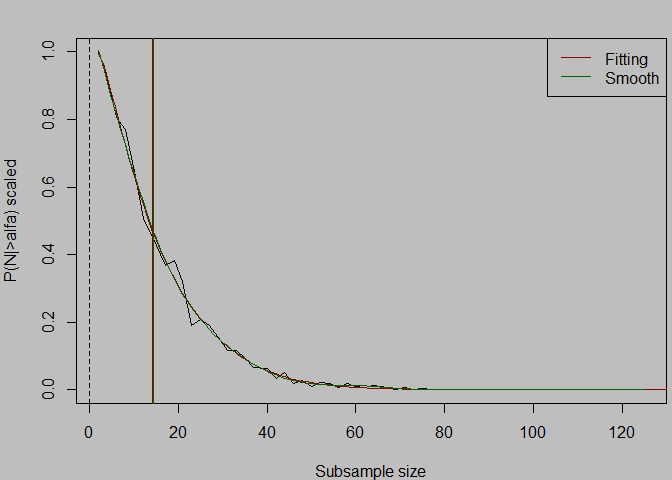

<!-- README.md is generated from README.Rmd. Please edit that file -->

# similaritystructure

<!-- badges: start -->

<!-- badges: end -->

`similaritystructure` estimates similarity structure between two samples
using repeated subsampling, statistical testing, smoothing and
parametric fitting.

## Installation

You can install the development version of similaritystructure like so:

``` r
devtools::install_github("serbiodh/similaritystructure")
```

## Example

This is a basic example which shows you how to solve a common problem:

``` r
library(similaritystructure)

seed <- 12345
set.seed(seed)
n1 <- rnorm(20000, 0, 1)
n2 <- n1 + 0.8

res <- similarity_structure(
  n1 = n1,
  n2 = n2,
  N_init = 2,
  N_fin = round((80/0.8^2)),
  num_N = 60,
  num_repet = 300,
  test = "t-test",
  alpha = 0.05,
  seed <- seed,
  plotting = TRUE
)
```



## Example files

The package includes example data and reproducible R Markdown scripts.

``` r
system.file("extdata", package = "similaritystructure")
system.file("examples", package = "similaritystructure")
```

For example, to open the t-test example:

``` r
file <- system.file(
  "examples",
  "example_01_ttest.Rmd",
  package = "similaritystructure"
)

file.edit(file)
```
